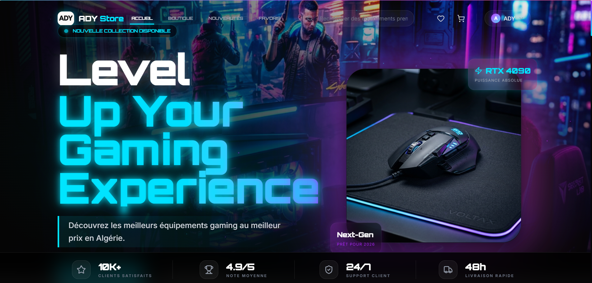
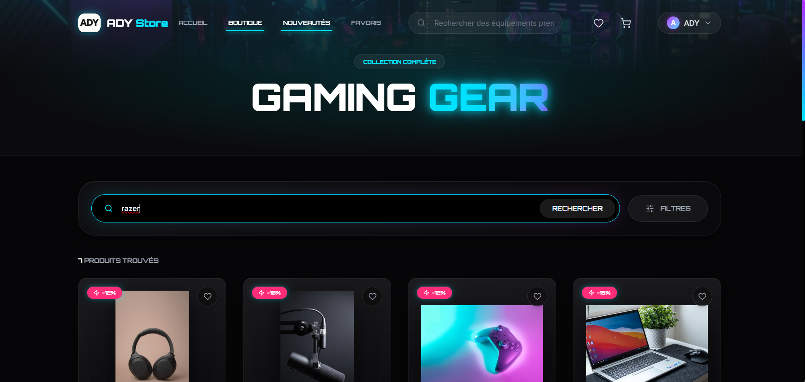
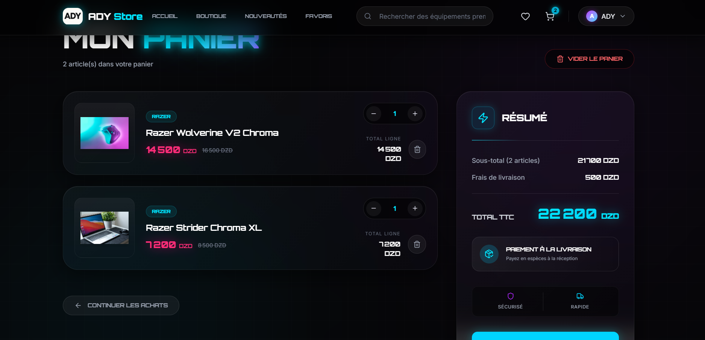
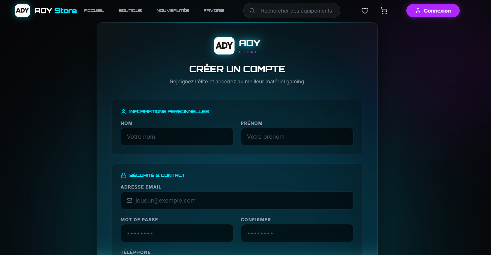
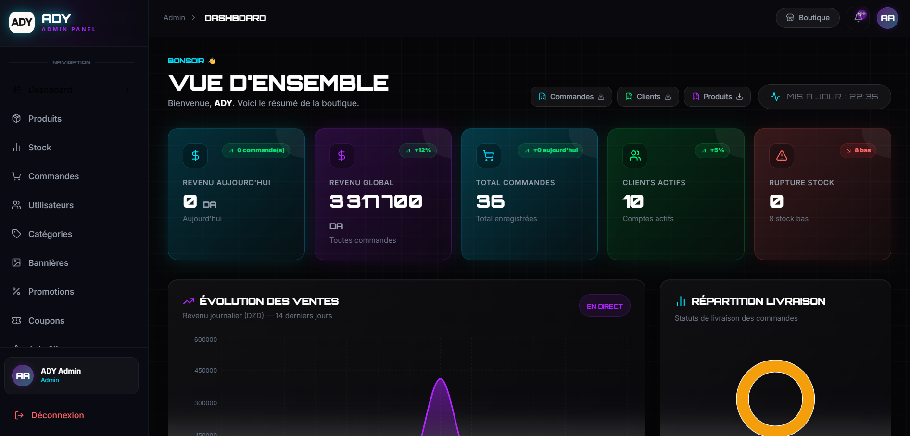
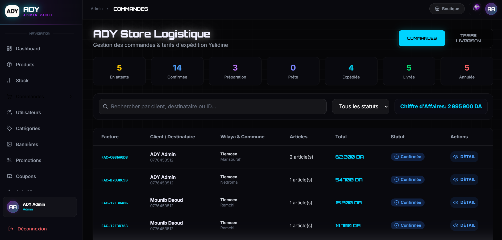
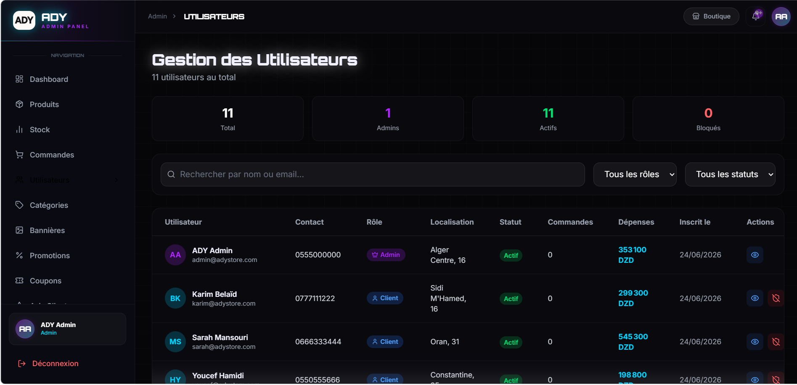
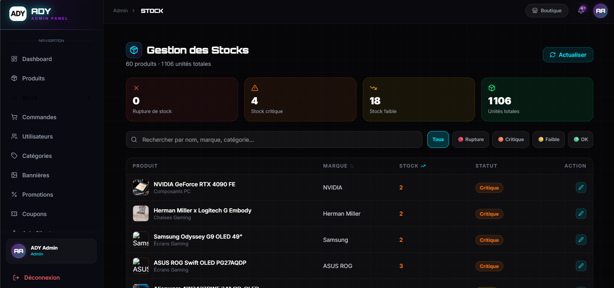
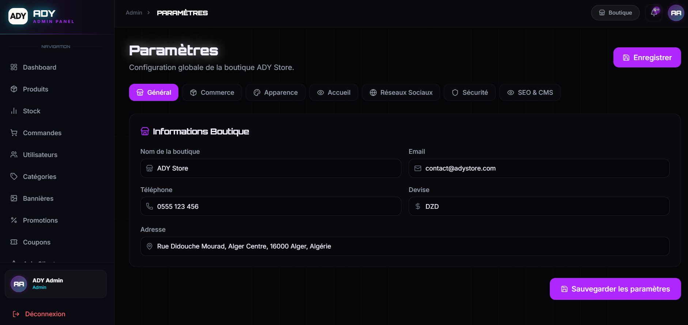

🎮 ADY Store

ADY Store is a modern full-stack Algerian Gaming E-commerce platform built with the MERN Stack.

It provides a complete online shopping experience with a professional Admin Dashboard for managing products, orders, customers, promotions, banners, stock, and analytics.

🚀 Features
👤 Customer
Secure Authentication (JWT)
Product Catalog
Smart Search
Categories
Wishlist
Compare Products
Shopping Cart
Checkout
Algerian Shipping (58 Wilayas)
Coupons
Promotions
Flash Deals
Product Variants
Image & Video Gallery
PDF Invoice
Order Tracking
Customer Dashboard
👨‍💼 Admin
Dashboard Analytics
Product Management
Stock Management
Banner Management
Promotions
Coupons
Categories
Orders Management
Users Management
Messages
Reviews
Security Logs
Reports
Homepage Hero Customization
🛠 Tech Stack
Frontend
React
Redux Toolkit
Tailwind CSS
React Router
Axios
Recharts
Socket.io Client
Backend
Node.js
Express.js
MongoDB
Mongoose
JWT
Multer
Socket.io
📸 Screenshots
## 🏠 Home

---

## 🛍 Shop

---

## 🛒 Cart

---

## 🔑 Login

---

## 📊 Admin Dashboard

---

## 📦 Orders

---

## 👥 Users

---

## 📈 Stock

---

## ⚙ Settings

⚙ Installation
# Backend
cd backend
npm install
npm run dev
# Frontend
cd frontend
npm install
npm run dev
👩‍💻 Author

Douaa Daoud

🎓 Software Engineering Student

📍 University of Tlemcen

🇩🇿 Algeria

⭐ If you like this project, don't forget to star it.
